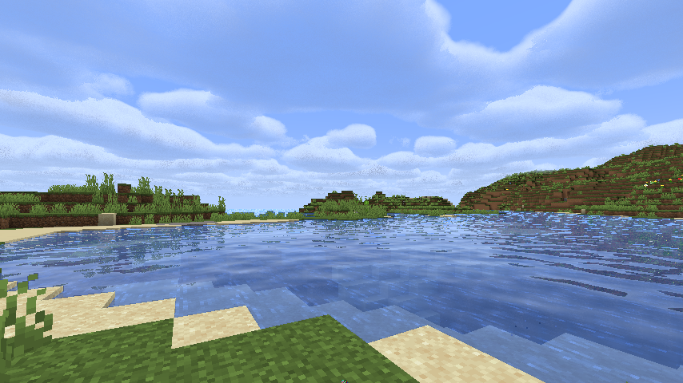

# vanilla-shader-base

## Uniform

Every 3 floating point variables take up 4 pixels.

1. pos.xyz
2. rotZ.xyz
3. rotY.xyz
4. cotHalfFov
5. gametime(s), fogStart, fogEnd
6. fogColor.xyz

Vertex color is passed directly.

1. chunkPos.xyz
2. daytime(gt), dimension, biome
3. nightVision

## Todo

多人情况为每个玩家分配单独的alpha区间和像素区域。

从太阳的alpha中提取下雨强度。

## Gallery

